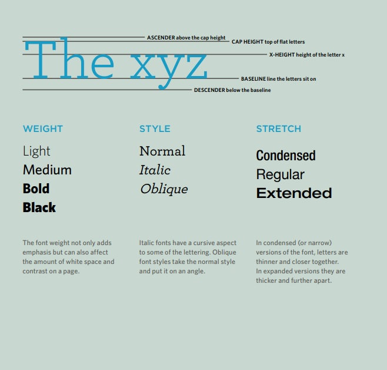
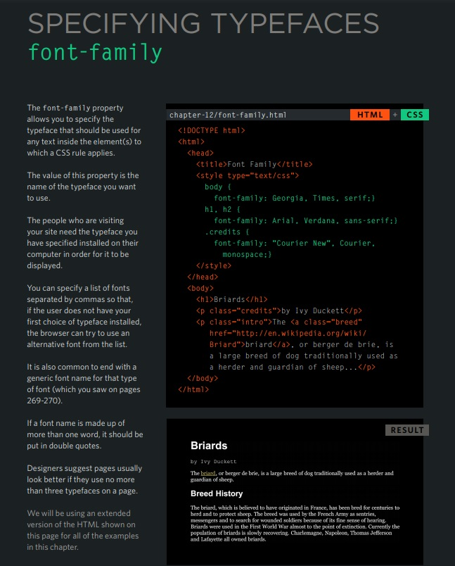

# Read: 05 - HTML Images; CSS Color & Text

## Chapter 5: Images
- - - 
#### In the beginning, the Web was just text, and it was really quite boring. Fortunately, it wasn't too long before the ability to embed images (and other more interesting types of content) inside web pages was added. There are other types of multimedia to consider, but it is logical to start with the humble  element, used to embed a simple image in a webpage. In this article we'll look at how to use it in depth, including the basics, annotating it with captions using <figure>, and detailing how it relates to CSSbackground images.

### How do we put an image on a webpage?

``
``
``
```bash

```
### Width and height

#### You can use the `width` and `height` attributes to specify the width and height of your image. You can find your image's width and height in a number of ways. For example on the Mac you can use `Cmd` + `I` to get the info display up for the image file. Returning to our example, we could do this:

```bash

```

### CSS background images

```bash
p {
  background-image: url("images/dinosaur.jpg");
}
```
## Chapter 11: Color

- `aqua / cyan`
- `fuchsia / magenta`
- `darkgray / darkgrey`
- `darkslategray / darkslategrey`
- `dimgray / dimgrey`
- `lightgray / lightgrey`
- `lightslategray / lightslategrey`
- `gray / grey`
- `slategray / slategrey`

### `currentColor` keyword

#### The currentColor keyword represents the value of an element's `color` property. This lets you use the color value on properties that do not receive it by default.

#### If currentColor is used as the value of the `color` property, it instead takes its value from the inherited value of the `color` property.

```bash
<div style="color:blue; border: 1px dashed currentColor;">
  The color of this text is blue.
  <div style="background:currentColor; height:9px;"></div>
  This block is surrounded by a blue border.
</div>
```

### RGB colors

- Syntax
- Hexadecimal notation: `#RRGGBB[AA]`
- Hexadecimal notation: `#RGB[A]`
- Functional notation: `rgb[a](R, G, B[, A])`
- Functional notation: `rgb[a](R G B[ / A])`

##### and much more
- - -

## Chapter 12: Text


- - -