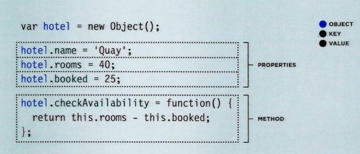
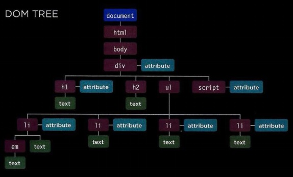
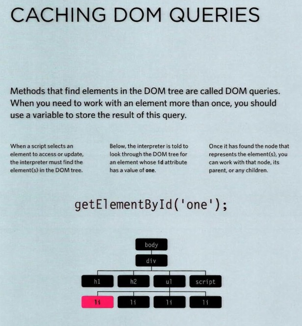
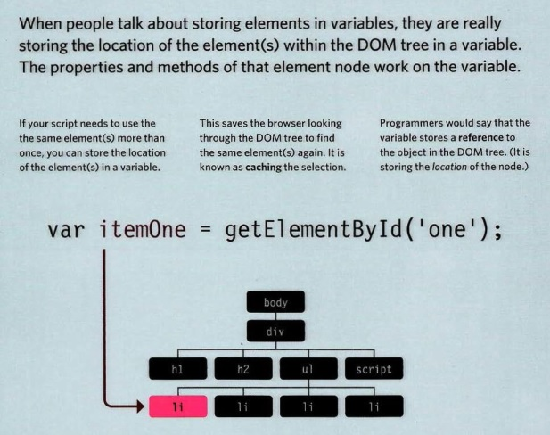
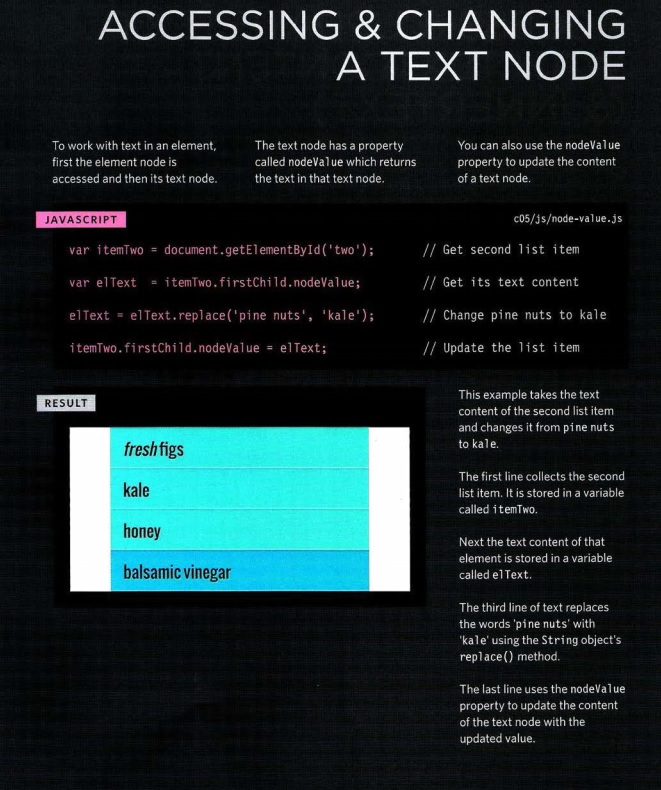

# Read: 06 - JS Object Literals; The DOM

## Chapter 3: “Object Literals”

### WHAT IS AN OBJECT?

#### Objects group together a set of variables and functions to create a model of a something you would recognize from the real world. In an object, variables and functions take on new names. 

- PROPERTIES:      KEY : VALUE
-                 name : string
-                rooms : number
-               booked : number
-                  gym : Boolean
-            roomTypes : array
-    METHODS: 
- -  checkAvailability :  function 



## Chapter 5: “Document Object Model”

### DOM TREE 



#### ATTRIBUTE NODES  
- The opening tags of HTML elements can carry attributes and these are represented by attribute nodes in the DOM tree. 

#### TEXT NODES 
- Once you have accessed an element node, you can then reach the text within that element. This is stored in its own text node.





### ACCESSING ELEMENTS

- getElementByld('id')
- querySelector('css selector') 
- getElementsByClassName('class')
- getElementsByTagName('tagName')
- querySelectorAll('css selector') 
- - Uses CSS selector syntax to select one or more elements and returns all of those that match.


### SELECTING AN ELEMENT FROM A NODELIST

#### There are two ways to select an element from a Nodelist:
#### The item() method and array syntax.
#### Both require the index number of the element you want. 

- THE item() METHOD
- - Nodelists have a method called item() which will return an individual node from the Node list.
- the ACCESSING ELEMENTS

- - -


```bash
// ADDING ITEMS TO START AND ENO OF LIST
var list = document .getEl ementsByTagName( ' ul ')[OJ; // Get the <u l> el ement
// ADD NEW ITEM TO END OF LIST
var newitemLast = document . createElement('li '); /// Create element
var newTextLast = document .createTextNode{'cream'); // Create text node
newitemLast.appendChild(newTextLast);
list.appendChild(newitemLast);
var newitemFirst = document . createElement('li ') ;
var newTextFirst = document.createTextNode('kale');
newitemFirst.appendChild(newTextFirst);
list.insertBefore(newitemFirst, list.firstChild);
 
```

1. Create the element node
2. Create the text node
3. Add the text node to the element node
4. Add the element to the DOM tree

### Document Object ModelSummary

- The browser represents the page using a DOM tree. 
- DOM trees have four types of nodes: document nodes, element nodes, attribute nodes, and text nodes.
- You can select element nodes by their id or class attributes, by tag name, or using CSS selector syntax.
- Whenever a DOM query can return more than one
node, it will always return a Nade list. 
- From an element node, you can access and update its content using properties such as textContent and innerHTML or using DOM manipulation techniques. 
- An element node can contain multiple text nodes and child elements that are siblings of each other. 
- In older browsers, implementation of the DOM is inconsistent (and is a popular reason for using jQuery). 
- Browsers offer tools for viewing the DOM tree.
