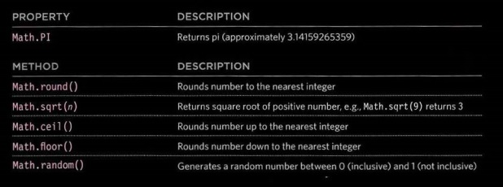
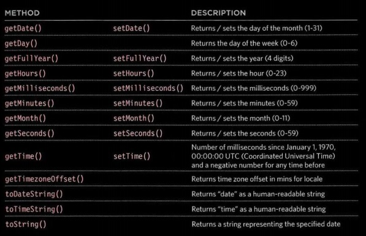
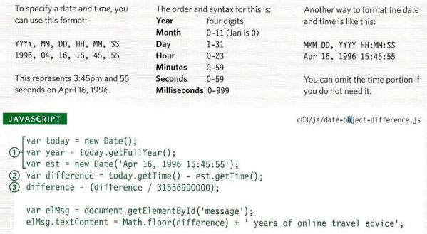

# Read: 07 - HTML Tables; JS Constructor Functions

## Chapter 6: “Tables”

### What's a Table?

#### A table represents information in a grid format. Examples of tables include financial reports, TV schedules, and sports results.

### Basic Table Structure

- `<table>`
- - `<tr>`
- - - `<td>`
- The `<th>` element is used justlike the `<td>` element but itspurpose is to represent theheading for either a column ora row. (The th stands for tableheading.)


## Chapter 3: “Functions, Methods, and Objects”

### a way to write on HTML
```bash
~ var msg = '<h2>length</h2><p> ' +saying.length+ '</p>'; 
msg += '<h2>uppercase</ h2><p>' + saying .toUpperCase() + '</ p>'; 
```
### GLOBAL OBJECTS: MATH OBJECT

### GLOBAL OBJECTS: DATE OBJECT (AND TIME)


#### CREATING A DATE OBJECT 

```bash
var today = new Date();
var year = today.getFullYear();
var el = document .getElementByld('foot er' );
el.innerHTML = '<p>Copyright &copy;' +year+ '</p>';
```
### WORKING WITH DATES & TIMES


### Functions, Methods & Objects
- Functions allow you to group a set of related statements together that represent a single task. 

- Functions can take parameters (informatiorJ required to do their job) and may return a value.
- An object is a series of variables and functions that
represent something from the world around you.
- In an object, variables are known as properties of the object; functions are known as methods of the object.
- Web browsers implement objects that represent both
the browser window and the document loaded into the
browser window. 
- JavaScript also has several built-in objects such as
String, Number, Math, and Date. Their properties and
methods offer functionality that help you write scripts.
- Arrays and objects can be used to create complex data
sets (and both can contain the other). 
- - -
