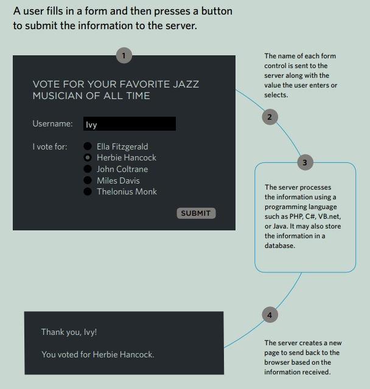

# Read: 09 - Forms and Events

## Chapter 7: “Forms” 

### Why Forms?

#### The best known form on the web is probably the search box that sits right in the middle of Google's homepage.

#### Form Controls

##### ADDING TEXT:

- Text input
```bash
<p>
Username:<input type="text" name="username"
size="15" maxlength="30" />
</p>
```
- Password input
```bash
<p>
Username: <input type="password" name="password"
size="15" maxlength="30" />
</p>
```
- Text area (multi-line)
```bash
<form action="http://www.example.com/comments.php">
    <p>What did you think of this gig?</p>
    <textarea name="comments" cols="20" rows="4">
        Enter your comments...
    </textarea>
</form>
```

##### ADDING TEXT: Making Choices:
- Radio buttons For use when a user must select one of a number of options.
```bash
<form action="http://www.example.com/profile.php">
    <p>Please select your favorite genre:
        <br />
        <input type="radio" name="genre" value="rock"
        checked="checked" /> Rock
        <input type="radio" name="genre" value="pop" />
        Pop
        <input type="radio" name="genre" value="jazz" />
        Jazz
    </p>
</form>
```
- Checkboxes When a user can select and unselect one or more options.

```bash
<form action="http://www.example.com/profile.php">
    <p>Please select your favorite music service(s):
        <br />
        <input type="checkbox" name="service"
        value="itunes" checked="checked" /> iTunes
        <input type="checkbox" name="service"
        value="lastfm" /> Last.fm
        <input type="checkbox" name="service"
        value="spotify" /> Spotify
    </p>
</form>
```
- Drop-down boxes When a user must pick one of a number of options from a list.
```bash
<form action="http://www.example.com/profile.php">
    <p>What device do you listen to music on?</p>
    <select name="devices">
        <option value="ipod">iPod</option>
        <option value="radio">Radio</option>
        <option value="computer">Computer</option>
    </select>
</form>
```

- Multiple Select Box
```bash
<form action="http://www.example.com/profile.php">
    <p>Do you play any of the following instruments?
    (You can select more than one option by holding
    down control on a PC or command key on a Mac
    while selecting different options.)</p>
    <select name="instruments" size="3"
        multiple="multiple">
        <option value="guitar" selected="selected">
        Guitar</option>
        <option value="drums">Drums</option>
        <option value="keyboard"
        selected="selected">Keyboard</option>
        <option value="bass">Bass</option>
    </select>
</form>
```
##### Submitting Forms:

- Submit buttons To submit data from your form to another web page.

- Image buttons Similar to submit buttons but they allow you to use an image.

- File upload Allows users to upload files (e.g. images) to a website




## Chapter 14: “Lists, Tables & Forms”

- - -

## Chapter 6: “Events”