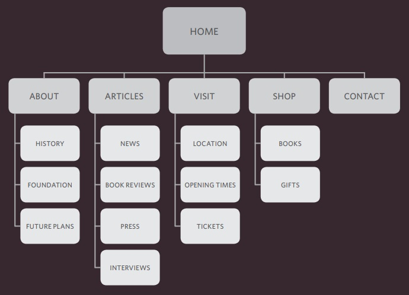
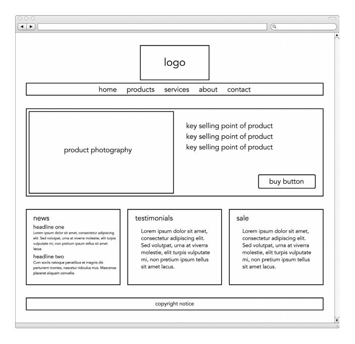

# Class 01: HTML and CSS 


#### it's not that hard to learn how to write web pages and read the code used to create them; you certainly don't have to be a "programmer."
#### web designers, website editors, marketers,managers all of them after Understanding HTML and CSS will make the work easier and better.
#### 

### How the Web Works?
1. When you connect to the web,
you do so via an Internet Service
Provider (ISP). You type a
domain name or web address
into your browser to visit a site;
for example: google.com,
bbc.co.uk, microsoft.com.
2. Your computer contacts a
network of servers called
Domain Name System (DNS)
servers. These act like phone
books; they tell your computer
the IP address associated with
the requested domain name.
An IP address is a number
of up to 12 digits separated
by periods / full stops. Every
device connected to the web
has a unique IP address; it is
like the phone number for that
computer.
3. The unique number that the
DNS server returns to your
computer allows your browser
to contact the web server
that hosts the website you
requested. A web server is a
computer that is constantly
connected to the web, and is set
up especially to send web pages
to users.
4. The web server then sends the
page you requested back to your
web browser.

### Summary
- HTML pages are text documents.
- HTML uses tags (characters that sit inside angled
brackets) to give the information they surround special
meaning.
- Tags are often referred to as elements.
- Tags usually come in pairs. The opening tag denotes
the start of a piece of content; the closing tag denotes
the end.
- Opening tags can carry attributes, which tell us more
about the content of that element.
- Attributes require a name and a value.
- To learn HTML you need to know what tags are
available for you to use, what they do, and where they
can go.

## Extra Markup

#### Notes
- **HTML** 4 Released **1997**.
- **XHTML** 1.0 Released **2000**.
- **XML** was published **1998** ( it was renamed **XHTML**).
- **HTML5** Released **2000**.
- Scalable Vector Graphics (**SVG**).
#### Extra Markup Summary
- DOCTYPES tell browsers which version of HTML you are using.
- You can add comments to your code between the `<!-- and -->` markers.
- The id and class attributes allow you to identify particular elements.
- The `<div>` and `<span>` elements allow you to group block-level and inline elements together.
- `<iframes>` cut windows into your web pages through which other pages can be displayed.
- The `<meta>` tag allows you to supply all kinds of information about your web page.
- Escape characters are used to include special characters in your pages such as `<`, `>`, and `©`.

## HTML5 Layout

#### Notes
- Helping Older Browsers Understand
```
header, section, footer, aside, nav, article, figure{
display: block;
}
```
```
 <!--[if lt IE 9]>
 <script src="http://html5shiv.googlecode.com/svn/trunk/html5.js"></script>
 <![endif]-->
```

#### HTML5 LAYOUT Summary

- The new HTML5 elements indicate the purpose of different parts of a web page and help to describe its structure.
- The new elements provide clearer code (compared with using multiple <div> elements).
- Older browsers that do not understand HTML5 elements need to be told which elements are block-level elements.
- To make HTML5 elements work in Internet Explorer 8 (and older versions of IE), extra JavaScript is needed, which is available free from Google.

## Process & Design

#### Who is the Site For?

##### Target Audience: individuals
- What is the age range of your target audience?
- Will your site appeal to more women or men? What is the mix?
- Which country do your visitors live in?
- Do they live in urban or rural areas?
- What is the average income of visitors?
- What level of education do they have?
- What is their marital or family status?
- What is their occupation?
- How many hours do they work per week?
- How often do they use the web?
- What kind of device do they use to access the web?

##### Target Audience: Companies
- What is the size of the company or relevant department?
- What is the position of people in the company who visit your site?
- Will visitors be using the site for themselves or for someone else?
- How large is the budget they control?

##### What Information Your Visitors Need
- Will visitors be familiar with your subject area / brand or do you need to introduce yourself?
- Will they be familiar with the product / service / information you are covering or do they need background information on it?
- What are the most important features of what you are offering?
- What is special about what you offer that differentiates you from other sites that offer something similar?
- Once people have achieved the goal that sent them to your site, are there common questions people ask about this subject area?

##### Example Site Map


##### Example Wireframe


#### PROCESS & Design Summary
- It's important to understand who your target audience is, why they would come to your site, what information they want to find and when they are likely to return.
- Site maps allow you to plan the structure of a site
- Wireframes allow you to organize the information that
will need to go on each page.
- Design is about communication. Visual hierarchy helps visitors understand what you are trying to tell them.
- You can differentiate between pieces of information using size, color, and style.
- You can use grouping and similarity to help simplify
the information you present.

