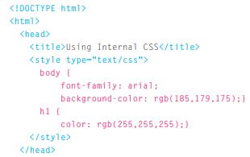
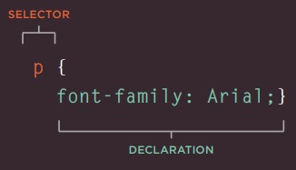
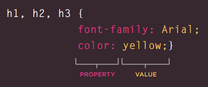
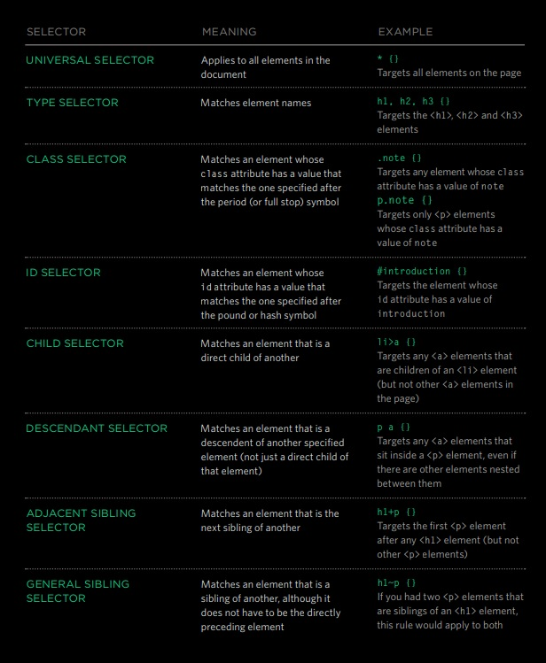
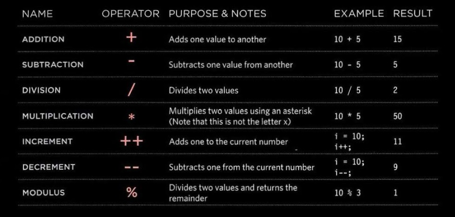
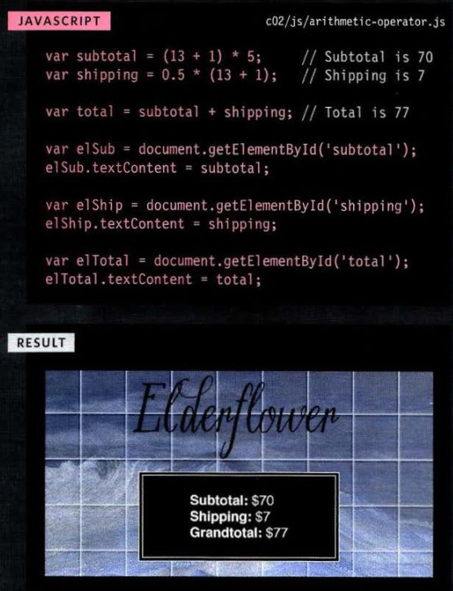

# Read: 02 - HTML Text, CSS Introduction, and Basic JavaScript Instructions

## HTML & CSS
### Chapter 2: Text

#### here is a table of tags for text

| Tag              | Useage                      |
| :--------------: | :----------------------:    |
| `<h1>` to `<h6>` | the biggest headings to the smallest hidding |
| `<p>`            | to create a paragraph, surround the words |
| `<b>`            | to make anything inside the tag `<b>`**BOLD**`</b>`.|
| `<i>`            | to make anything inside the tag `<i>`*italic*`</i>`. |
| `<sup>`          | to make the character superscript such as `2²` |
| `<sub>`          | to make the character subscript such as `2₂` |
| `<br />`         | to create or jump new line |
| `<hr />`         | to create a break between themes |
| `<strong>`       | to make content has strong importance it will show as **BOLD** |
| `<em>`           | to subtly changes the meaning of a sentence, it will show as *italic* |
| `<blockquote>`   | to create block of quote, also you need to add `<p>` or any text tag |
| `<q>`            | to create double quotes arround the text |
| `<abbr>`         | to create pop up window that tell you more info about the text |
| `<cite>`         | to referencing a piece of work such as a *book*, *film*. |
| `<dfn>`          | to indicate the defining instance of a new term. |
| `<address>`      | to contain contact details for the author of the page. |
| `<ins>`          | to put line under the content |
| `<del>`          | to put horizontal line in the middle of the text like you delete it. |
| `<s>`            | to  indicates something that is no longer accurate or relevant. |

#### TEXT Summary
- HTML elements are used to describe the structure of the page (e.g. headings, subheadings, paragraphs).
- They also provide semantic information (e.g. where emphasis should be placed, the definition of any acronyms used, when given text is a quotation).


### Chapter 10: Introducing CSS

#### to link CSS file to the HTML page we use `<link>`
`<link href="css/styles.css" type="text/css" rel="stylesheet" /> `:

1. `href` This specifies the path to the CSS file (which is often placed in a folder called css or styles)

2. `type` This attribute specifies the type of document being linked to. The value should be text/css.

3. `rel` This specifies the relationship between the HTML page and the file it is linked to. The value should be stylesheet when linking to a CSS file.

#### Using Internal CSS

# 

#### How to CSS

# 

#### How to change aspects to multi tags at the same time.

# 


# 
#### Why use External Style Sheets?
- All of your web pages can share the same style sheet.
- If you want to make a change to how your site appears, you only need to edit the one CSS file and all of your pages will be updated.
- the one CSS style sheet, rather than changing the CSS rules on every page saves time.

#### just to know 
- **CSS1** was released in **1996**.
- **CSS2** was released in **1998**.

### INTRODUCING CSS Summary
- CSS treats each HTML element as if it appears inside its own box and uses rules to indicate how that element should look.
- Rules are made up of selectors (that specify the elements the rule applies to) and declarations (that indicate what these elements should look like).
- Different types of selectors allow you to target your rules at different elements.
- Declarations are made up of two parts: the properties of the element that you want to change, and the values of those properties. For example, the font-family property sets the choice of font, and the value arial specifies Arial as the preferred typeface.
- CSS rules usually appear in a separate document, although they may appear within an HTML page.

## Chapter 2: “Basic JavaScript Instructions”
#### JAVASCRIPT IS CASE SENSITIVE
##### JavaScript is case sensitive so hourNow means something different to HourNow or HOURNOW.

##### You should write comments to explain what your code does.
##### They help make your code easier to read and understand.
##### This can help you and others who read your code. 
##### here is how you can do it `/*` comment `*/`.
##### NUMERIC DATA TYPE `0.75`
##### STRING DATA TYPE `'Hi, Ivy!'`
##### BOOLEAN DATA TYPE `true`

# 

#### RULES FOR NAMING VARIABLES 
1. The name must begin with a letter, dollar sign ($),or an underscore (_). It must not start with a number.
2. The name can contain letters, numbers, dollar sign ($), or an underscore (_). Note that you must not use a dash(-) or a period (.) in a variable name.
3. You cannot use keywords or reserved words. Keywords are special words that tell the interpreter to do something. For example, var is a keyword used to declare a variable. Reserved words are ones that may be used in a future version of JavaScript.
4. All variables are case sensitive, so score and Score would be different variable names, but it is bad practice to create two variables that have the same name using different cases. 
5. Use a name that describes the kind of information that the variable stores. For example, fi rstName might be used to store a person's first name, l astNarne for their last name, and age for their age.
6. If your variable name is made up of more than one word, use a capital letter for the first letter of every word after the first word. For example, f i rstName rather than fi rstnarne (this is referred to as camel case). You can also use an underscore between each word (you cannot use a dash).
# 
#### An array is a special type of variable. It doesn't just store one value; it stores a list of values.
```
var colors;
colors ['white', 'black', 'custom']; 
```
#### array created using a different technique called an array constructor
```
var colors;
colors ['white',
        'black',
        'custom']; 
```
### operations like:

#### Arithmatic operations:
- + for summation
- * for multiplication
- / for division
- Logical Operations:
- <>, ==, >=, <=, != for comparison
##### here is some examples:

# 
#### here is example how to add text by id to HTML using JavaScript:

# 
#### basic JavaScript Instructions Summary
- A script is made up of a series of statements. Each statement is like a step in a recipe.
- Scripts contain very precise instructions. For example, you might specify that a value must be remembered before creating a calculation using that value.
- Variables are used to temporarily store pieces of information used in the script.
- Arrays are special types of variables that store more
than one piece of related information.
- JavaScript distinguishes between numbers (0-9),
strings (text), and Boolean values (true or false).
- Expressions evaluate into a single value.
- Expressions rely on operators to calculate a value.
# 


# Chapter 4: “Decisions and Loops”

#### Comparison Operators:
1. `==` mean **IS EQUAL TO?** 
2. `!=` mean **IS NOT EQUAL TO?**
3. `===` mean **STRICT EQUAL TO (100%)**.
4. `!==` mean **STRICT NOT EQUAL TO**  eg. (`"3" !== 3`) the answer is true.
5. `&&` mean **LOGICAL AND** This operator tests more than one condition `((3 < 6>) && (2>=1))` returns `true`.
6. `||` mean **LOGICAL OR** This operator tests at least one condition.
7. `!` mean **LOGICAL NOT** This this operator takes a single boolean value and inverts it.
