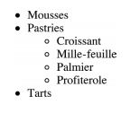

# Read: 03 - HTML Lists, CSS Boxes, JS Control Flow

## Duckett HTML book

### Chapter 3: “Lists”

#### Ordered Lists

1. `<ol>` stand for ordered list & `<ul>` stand for unordered list.
2. `<li>` stand for  list item.

#### Definition Lists

1. `<d1>` Definition list.
2. `<dt>` the definition term (Name).
3. `<dd>`  the definition.

#### Nested Lists

##### You can put a second list inside an `<li>` element to create a sublist or nested list.

```bash
<ul>
    <li>Mousses</li>
    <li>Pastries
        <ul>
        <li>Croissant</li>
        <li>Mille-feuille</li>
        <li>Palmier</li>
        <li>Profiterole</li>
        </ul>
    </li>
    <li>Tarts</li>
</ul>
```



#### Lists Summary

- There are three types of HTML lists: ordered, unordered, and definition.
- Ordered lists use numbers.
- Unordered lists use bullets.
- Definition lists are used to define terminology.
- Lists can be nested inside one another.

### Chapter 13: “Boxes”

#### Box Dimensions

##### width, height

##### we do it like this

- `div.box` in CSS this will create box around the div tag.
- - inside of it you will define the `height: 0px` & `width: 0px:`.

#### Limiting Width

##### min-width, max-width

##### here is how

- `td.description` in the CSS this will o fit the size of the user's screen.
- - helpful properties to ensure that the content of pages are legible (especially on the smaller screens of handheld devices).

#### Limiting Height

##### min-height, max-height

1. limit the width and height or a box on a page.
2. `{min-height: 0px; max-height: 0px;}` in CSS this will let you limit the element.

#### Overflowing Content

## Duckett JS book

### Chapter 2: “Basic JavaScript Instructions”

#### ARRAYS

#### An array is a special type of variable. It doesn't just store one value; it stores a list of values

```bash
var colors;
colors ['white', 'black', ' custom'];
var el document.getElementByld('col ors');
el . textContent = colors[O]; 
```

```bash
let colors= ['white',
             'black',
             'custom'];
```

- here is how you can pick the Color you want from the Array upside:
- - `itemThree = colors [0] ;` this will pick the white color.

#### ACCESSING & CHANGING VALUES IN AN ARRAY

- its too simple to change any value in the array up side, just like this `colors[2] = 'red';`.
- - now the custom value will be red like this:

```bash
let colors= ['white',
             'black',
             'red'];
```

### Chapter 4: “Decisions and Loops” from switch statements

#### USING SWITCH STATEMENTS


#### In this example, the purpose
#### of the switch statement is to present the user with a different message depending on which level they are at. The message is stored in a variable called msg.

#### The variable called l eve 1 contains a number indicating which level the user is on. This is then used as the switch value. (The switch value could also be an expression.)

#### In the following code block (inside the curly braces), there are three options for what the value of the 1eve1 variable might be: the numbers 1, 2, or 3.

#### If the value of the 1eve1 variable is the number 1, the value of the msg variable is set to 'Good luck on the first test'.

#### If the value is 2, it will read: 'Second of three - keep going! ·

#### If the value is 3, the message will read: 'Final round, almost t here!'

#### If no match is found, then the value of the msg variable is set to 'Good l uck! '

#### Each case ends with the break keyword which will tell the JavaScript interpreter to skip the rest of this code block and continue onto the next ·

```bash
var msg;
var level = 2;

// Determine message based on level
switch (level) {
case 1:
msg = 'Good luck on the first test ' ;
break;
case 2:
msg = 'Second of three - keep going!';
break;
case 3:
msg = ' Final round, al most there!';
break;
default :
msg = 'Good l uck!';
break;
var el = document.getEl ementByld('answer');
el .textContent = msg;
```
