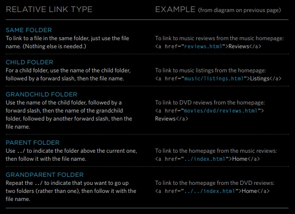

# Read: 04 - HTML Links, CSS Layout, JS Functions

## Chapter 4: Ch.4 “Links”

### Writing Links

#### Links are created using the `<a>` element

- Links are created using the `<a>` element.
- - `href` is the page the link takes you to.
- - `IMDB` This is the text the user clicks on.

```bash 
<a href="http://www.imdb.com">IMDB</a>
```

#### Relative URLs can be used when linking to pages within your own website. They provide a shorthand way of telling the browser where to find your files



### Email Links

#### here is how you can link mailto:

```bash
<a href="mailto:him@mail.com">Email Jon</a>
```

- add `href="email"` inside the opening tag.

- between the opeining and closing tag add here the title of the hypyer link to send the email.

### Opening Links in a New Window

```bash
<a href="http://www.imdb.com" target="_blank">
Internet Movie Database</a>
```

- we only need to add new attribute `target="_blank"`

#### we use this type when the user still need our current page

### Linking to a Specific Part of the Same Page

- give the part you want to travel to a id in the tag like `id="ali"`

- in the `href="#ali"`

- prefare to have the same part head name inside the link tag

- here is example

```bash
<a href="#ali">Arc Shot</a><br />
```

- here is the part i want to link to it

```bash
<h2 id="ali">Arc Shot</h2>
```

### Linking to a Specific Part of Another Page

#### this is so simple you need just to add `#theid` after the link

- like this

```bash
https://www.google.com/search?qattribute&aqs#LC20lb%20DKV0Md
```
#### Links Summary

- Links are created using the `<a>` element.
- The `<a>` element uses the href attribute to indicate the page you are linking to.
- If you are linking to a page within your own site, it is best to use relative links rather than qualified URLs.
- You can create links to open email programs with an email address in the "to" field.
- You can use the id attribute to target elements within a page that can be linked to.

## Chapter 15: Layout

- `<div>` elements are often used as containing elements to group together sections of a page.
- Browsers display pages in normal flow unless you specify relative, absolute, or fixed positioning
- The float property moves content to the left or right of the page and can be used to create multi-column layouts. (Floated items require a defined width.)
- Pages can be fixed width or liquid (stretchy) layouts.
- Designers keep pages within 960-1000 pixels wide, and indicate what the site is about within the top 600 pixels (to demonstrate its relevance without scrolling).
- Grids help create professional and flexible designs.
- CSS Frameworks provide rules for common tasks.
- You can include multiple CSS files in one page.

## JavaScript

### Function

#### Declaring a Function

```bash
function sayhello(){
    document.write('hello!`);
}
```

#### Calling a Function

- so simple you just type : `functionName();`

#### Declaring Functions That Need Information

```bash
function getArea(width, height){
    return width * height;
}
```

#### Calling Functions that need information

```bash
functionName(infoOne, infoTwo);
```

#### Getting a single Value out of Function

```bash
    return infoOne;
```

#### Getting multiple Values out of a Function

- we can simply do that by creating arrey inside the function first then we return the array it self.

```bash
function getInfo(age, tall)
let age = prompt("how old are you?")
alert("you are" + age + "old!")
let age = prompt("how old are you?")
let ahmad = [age, tall];
return ahmad;
```

## Pair Programming

- “two heads are better than one”.
- a way we foster a collaborative environment while developing key industry skills.

### How does it work?

- one should be **Driver** : this guy will write the codes
- the other is the **Navigator** : this guy uses their words to guide the Driver but does not provide any direct input to the computer.

### Why pair program?

1. Greater efficiency
2. Engaged collaboration
3. Learning from fellow students
4. Social skills
5. Job interview readiness
6. Work environment readiness

- - -

#### Extra idea about this

#### `[Jose Perez]()` said

#### Another..it can be done remotely! Very 2020! The tools for remote pair programming have improved a lot! I found a YC company that has launched a tool for remote PP, includes video+audio, is P2P, and supports multiple IDEs (Jetbrains, VSC. )
