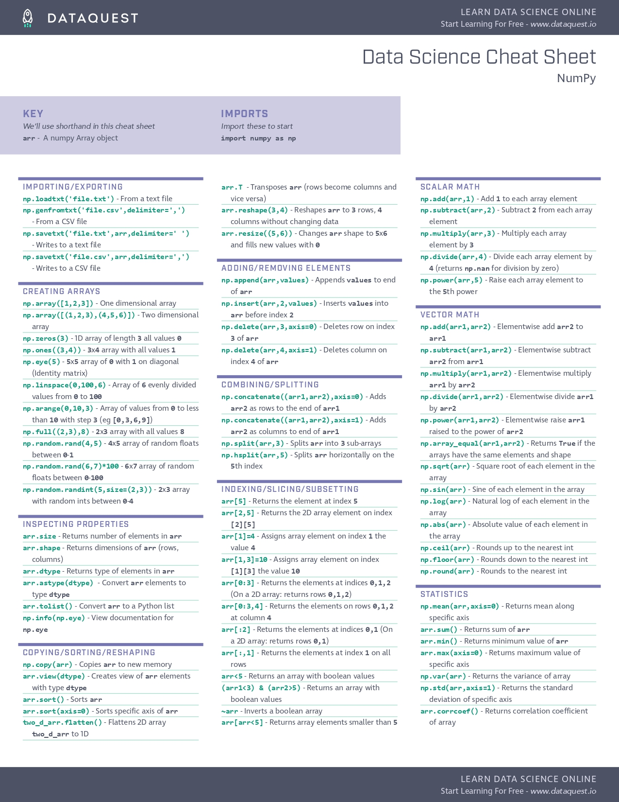

# Data Analysis

## NumPy Tutorial: Data Analysis with Python

NumPy is a commonly used Python data analysis package. By using NumPy, you can speed up your workflow, and interface with other packages in the Python ecosystem, like scikit-learn, that use NumPy under the hood. NumPy was originally developed in the mid ***2000s***, and arose from an even older package called **Numeric**. This longevity means that almost every **data analysis** or **machine learning** package for Python leverages NumPy in some way.

- **ssv** format (semicolon separated values)
- each record is separated by a semicolon (;)
- csv.reader object, which will allow us to read in and split up all the content from the ssv file.

```py
import csv # Import the csv library.
with open('file.csv', 'r') as f:  # Open the winequality-red.csv file. 
    data = list(csv.reader(f, delimiter=';')) # read the file using csv and split it with ";"
```

print out the first 3 rows:

```py
print(data[:3])
```

### Numpy 2-Dimensional Arrays - Creating A NumPy Array

We can create a NumPy array using the `numpy.array` function.

```py
import numpy as np
data = np.array(data[1:], dtype=np.float) # convert data to float after line 1
```

We can check the number of rows and columns in our data using the shape property of NumPy arrays:

`wines.shape`

### Alternative NumPy Array Creation Methods

```py
import numpy as np
empty_array = np.zeros((3,4))
## zeros(will make every element 0) 3(for rows) 4(for columns)
```

It’s useful to create an array with all zero elements in cases when you need an array of fixed size, but don’t have any values for it yet.

You can also create an array where each element is a random number using numpy.random.rand.

```py
np.random.rand(3,4)
```

Creating arrays full of random numbers can be useful when you want to quickly test your code with sample arrays.

### NumPy To Read In Files

- Use the genfromtxt function to read in the winequality-red.csv file.
- Specify the keyword argument delimiter=";" so that the fields are parsed properly.
- Specify the keyword argument skip_header=1 so that the header row is skipped.

```py
wines = np.genfromtxt("winequality-red.csv", delimiter=";", skip_header=1)
```

## and here is the nimpy cheat sheet:-



refrance: https://www.dataquest.io/blog/numpy-tutorial-python/