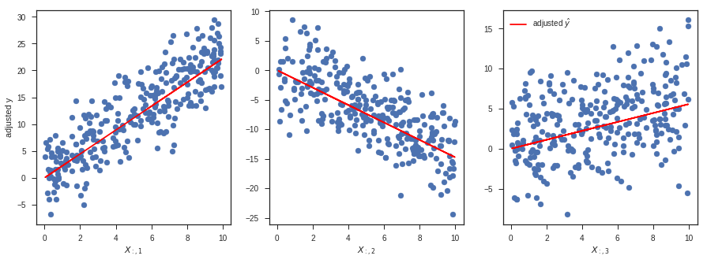

# Linear Regressions

## How to Run Linear Regression in Python

we can do that using **Scikit-learn**

Scikit-learn is a powerful Python module for machine learning. It contains function for regression, classification, clustering, model selection and dimensionality reduction.

Exploring Boston Housing Data Set

first step is to import the required Python libraries into Ipython Notebook.

```py
%matplotlib inline
import numpy as np
import panda as pd
import scipy.stats as stats
import matplotlib.pyplot as plt
import sklearn
```

```py
from sklearn.model_selection import train_test_split
boston = load_bostan()
```

The object boston is a dictionary, so you can explore the keys of this dictionary.

```py
boston.keys()
# or
boston.data.shapex
```

convert boston.data into a pandas data frame.

```py
bos = pd.DataFrame(boston.data)
bos.head()
```



Residual plots are a good way to visualize the errors in your data. If you have done a good job then your data should be randomly scattered around line zero. If you see structure in your data, that means your model is not capturing some thing
