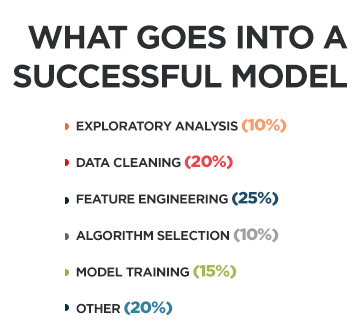

# Machine Learning Intro

##  Data Science Primer

so i want to give my obnion about Data Cleaning, I was always thinking that the first thing is good for having good data is to fliter the data and reshape becouse humans can do this really good with the knowledge

- Tip #1 - Don’t sweat the details (for now).

- Tip #2 - Don’t worry about coding (yet).

## Exploratory Analysis

training a ML model is like growing a startup. You also have too many tactics to choose from:

“Exploratory Analysis.” (Which is just fancy-talk for “getting to know” your data.) to avoid chasing dead ends

Doing this upfront helps you save time and avoid wild goose chases… As a data scientist, you are a commander with limited resources (i.e. time).

Exploratory analysis is like sending scouts to learn where to deploy your forces!

## Data Cleaning

Better data beats fancier algorithms…

**Garbage in = Garbage out... Plain and Simple! If you have a clean dataset, even simple algorithms can learn impressive insights from it!**

## Feature Engineering

- need domain knowledge to add informative features instead of more noise.

## Algorithm Selection

goal is to explain a few essential concepts (e.g. regularization, ensembling, automatic feature selection) that will teach you why some algorithms tend to perform better than others.

We have two main goals:

1. To explain powerful mechanisms in modern ML.

2. To introduce several algorithms that use those mechanisms.

## Model Training

data scientists actually do spend most their time on the earlier steps:

1. Exploring the data.
2. Cleaning the data.
3. Engineering new features.

Again, that’s because better data beats fancier algorithms.

