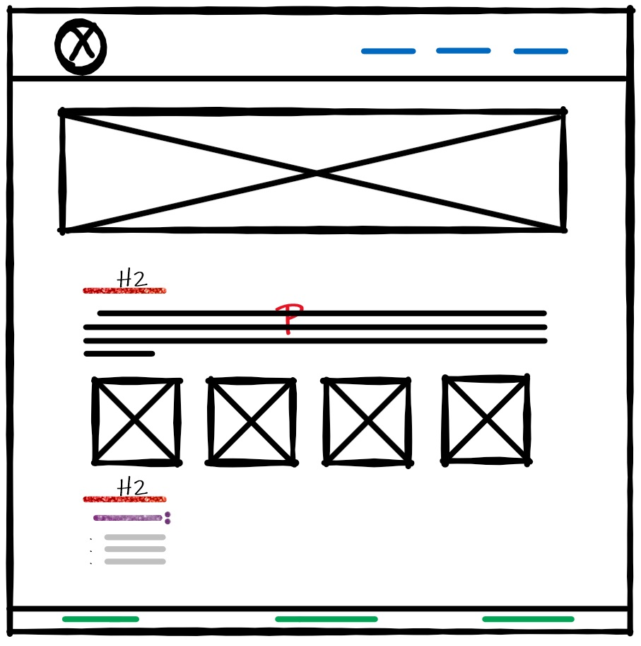
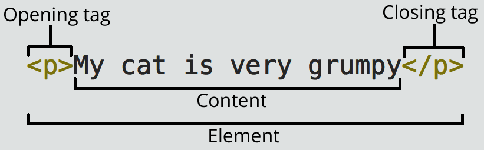

# WireFrame and HTML
## WireFrame:
#### Wireframing is a practice used by UX designers which allows them to define and plan the information hierarchy of their design for a website, app, or product. This process focuses on how the designer or client wants the user to process information on a site, based on the user research already performed by the UX design team.
## Here is my first wire frame:

### Why create a WireFrame ?
#### When designing for the screen you need to know where all the information is going to go in plain black and white diagrams before building anything with code. Wireframing is also a great way of getting to know how a user interacts with your interface, through the positioning of buttons and menus on the diagrams.

### How to make your wireframe in six steps?
- Do your research.
- Prepare your research for quick reference.
- Make sure you have your user flow mapped out.
- Draft, don’t draw. Sketch, don’t illustrate.
- Add some detail and get testing.
- Start turning your wireframes into prototypes.

## HTML:
#### TML is a markup language that defines the structure of your content. HTML consists of a series of elements, which you use to enclose, or wrap, different parts of the content to make it appear a certain way, or act a certain way. The enclosing tags can make a word or image hyperlink to somewhere else, can italicize words, can make the font bigger or smaller.

### Anatomy of an HTML element:
- The opening tag
- The closing tag
- The content
- The element