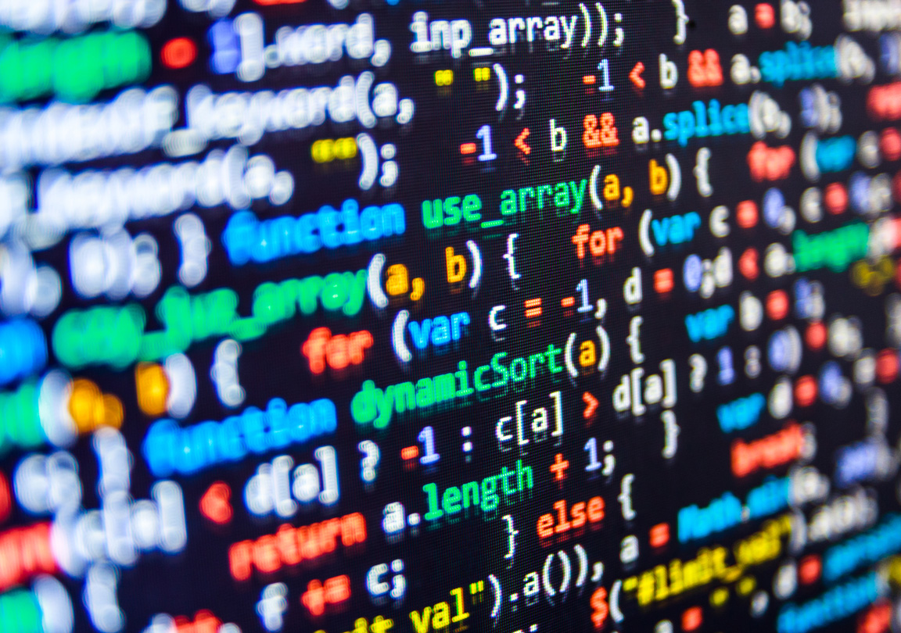

# Expressions and operators
## Operators
> ### JavaScript has the following types of operators. This section describes the operators and contains information about operator precedence.

# 
### JavaScript operators:

- Assignment operators: **ex:`x = x << y`** or **`x ||= y`**.
- Comparison operators: **ex: `var var1 = 3;`** or  **`(===)`** to Returns true if both sides 100% the same.
- Arithmetic operators: **ex: *(+, -, *, /)** uses main Mathmatic signs and logics.
- Bitwise operators: **ex: `a >> b`** or  **`a | b`** set of 32 bits (zeros and ones);like binary but in JavaScript.
- Logical operators: **ex: `&&`** use it like (logical AND) or  **`||`** use it as (logical OR) or  **`!`** for this mean can't be true!
- String operators: **ex `'alpha'+'bet'= ""`** also you can add info after info by using **`=+`**.
- Conditional (ternary) operator **ex`m7md>jamal ? yes : no;`** if true type yes if false type no.
- Comma operator: **ex: `,`is to Array**.
- Unary operators: **ex: `delete`** or  **`typeof`** **`void`**
- Relational operators: **ex:`in`** or  **`instanceof`**
# 
## Expressions:



#### Basic keywords and general expressions in JavaScript.
#### Here is some types of Expressions in JavaScript
1. ### `this`: 
### we use  this either with the dot or the bracket notation:
```
this['propertyName']
this.propertyName
```
### also there is more like 
2. ### `new`: 
2. ### `super`
> I will type more once i learn about this